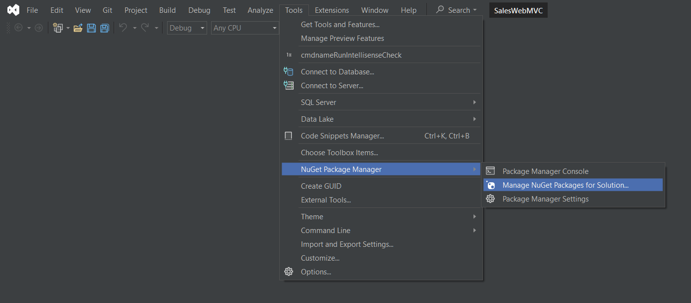

# SalesWebMVC Updated Project (.NET 8)
>Desenvolvendo um projeto [**ASP.NET MVC**](https://dotnet.microsoft.com/en-us/apps/aspnet/mvc) de uma aplicação modelo baseada no projeto [*#workshop-asp-net-core-mvc*](https://github.com/acenelio/workshop-asp-net-core-mvc) do professor [*@acenelio*](https://github.com/acenelio) a partir do curso [**"C# COMPLETO Programação Orientada a Objetos + PROJETOS"**](https://www.udemy.com/course/programacao-orientada-a-objetos-csharp/) na *Udemy*.
O meu propósito com este projeto é atualizar a versão desenvolvida em [**.NET 2.1**](https://learn.microsoft.com/en-us/dotnet/core/whats-new/dotnet-core-2-1) para a versão mais recente do framework ([**.NET 8.0**](https://learn.microsoft.com/en-us/dotnet/core/whats-new/dotnet-8/overview))
## _Get Started_
Existem diferentes ferramentas de desenvolvimento para utilizar o **C#/.NET**, sejam IDEs (como o [_**Visual Studio 2022 Community**_](https://visualstudio.microsoft.com/pt-br/vs/community/) da *Microsoft* ou [_**Rider**_](https://www.jetbrains.com/pt-br/rider/) da *JetBrains*) ou editores de texto (o melhor exemplo é o [_**Visual Studio Code**_](https://code.visualstudio.com/Download) com extensões razoáveis para desenvolver em **.NET** — [**C#**](https://marketplace.visualstudio.com/items?itemName=ms-dotnettools.csharp) e [**C# Dev Kit**](https://marketplace.visualstudio.com/items?itemName=ms-dotnettools.csdevkit)). No caso, utilizarei os exemplos com o _**VS 2022**_ e o _**VS Code**_, já que o no caso do **VS Code** é necessário rodar todas as instruções no _**.NET CLI**_.

> Antes de mais nada, volto a reforçar que, para o projeto eu utilizei a versão **8.0.5** (**SDK 8.0.300**) do **.NET 8**, então, verifique sua versão com o comando:
>```bash
> dotnet --version
>```
> ou veja se há algum **SDK** desta versão em sua máquina e utilize-a:
>```bash
> dotnet --list-sdks
>```

Para começar a aplicação, vamos inicializar um projeto com **ASP.NET MVC**.

 Com _**.NET CLI**_:
```bash
dotnet new mvc -o YourProject
```
Ou com o *template* padrão **MVC** do _**Visual Studio**_ (na interface, acesse **_File_>_New_>_Project_** ou _**Ctrl+Shift+N**_):


> **IMPORTANTE**: não irei me ater em explicar sobre o _MySQL_, _MVC_ ou _Entity Framework_, é necessário já ter noções básicas para reproduzir o projeto de modo fluído.

Agora, para podermos manipular o código sem problema, vamos instalar o pacote do _**MySQL**_ (considerando que você já tenha instaldo _**SGBD**_ em sua máquina) para nossa aplicação pelo _**Nuget**_, o [_`MySql.Data 8.4.0`_](https://www.nuget.org/packages/MySql.Data/) (que foi o pacote que eu utilizei - _fique a vontade para mudanças ou sugestões_) e o [_`MySql.EntityFrameworkCore 8.0.2`_](https://www.nuget.org/packages/MySql.EntityFrameworkCore/): <br>
Existem alguns caminhos, listarei três deles: (execute as instruções no diretório do projeto)
- Pelo _**.NET CLI**_:
```bash
dotnet add package MySql.Data --version 8.4.0
dotnet add package MySql.EntityFrameworkCore --version 8.0.2
```
- Pelo _**Package Manager**_:

```bash
PM> Install-Package MySql.Data -Version 8.4.0
PM> Install-Package MySql.EntityFrameworkCore -Version 8.0.2
```
- Pela interface do _**Visual Studio**_:




## Concepção
Como a implementação do projeto no curso já é um tanto quanto antiga, pois a versão do **.NET 2.1** é de 2018, sendo que o patch mais recente é de 2021.
Aliás, no próprio site de [download da versão](https://dotnet.microsoft.com/en-us/download/dotnet/2.1) não recomenda o uso da versão porque esta não recebe mais suporte, ou seja, é insegura - recomendando o .NET 8.0 (que é LTS).
## Implementação
...